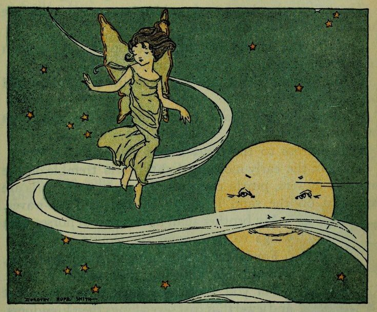

# My First Coding Assignment
## 

## About Me
### I am a current MAMC graduate student at the University of Florida concentrating in Digital Strategy. I graduated from the University of North Florida in 2023 with my BA in English and a minor in marketing. Outside of school, I enjoy reading, watching TV/anime, thrift shopping, and playing video games. I also have a dog named Kylo, who is my best bud! The photo I provided above represents my long-time love of faeries and fascination with the Moon.

## Past Coding Experience
### I do not have any prior experience or education in coding. This is my first coding class, and I am excited to keep learning!

## Career Goals
### 1. Use my knowledge of digital marketing, copywriting, and web design to obtain a role within product management or UI design.
### 2. Work for ethical tech companies building efficient web pages and/or user interfaces
### 3. Have the ability to utilize both my creative skills and technical skills in a single role